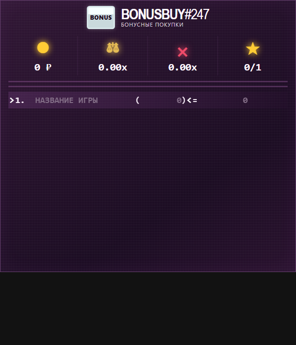

<p align="center">
  
</p>

<h1 align="center">BonusBuy Widget</h1>

<p align="center">
  <strong>Оверлей для стримеров, которые крутят бонусные покупки в слотах.</strong><br>
  Показывает закуп, средний икс, сколько нужно до окупа и текущую бонуску — прямо на сцене OBS.
</p>

<p align="center">
  
  
  
</p>

---

## Зачем это нужно

На стриме Bonus Buy зрители должны сразу видеть картину: сколько уже вложено, какие бонуски открыты, какой икс нужен, чтобы выйти в ноль, и какая игра крутится прямо сейчас.

**BonusBuy Widget** — это маленький сервер и страница для OBS:

- **Публичный виджет** `/` — только показ. Зрители и браузерный источник OBS ничего не редактируют.
- **Админка** `/admin` — стример или модератор вводит названия, цены и результаты. OBS подхватывает изменения сам.

Два окна, одни данные. Можно править список с телефона или второго компьютера, пока стрим идёт.

## Что видно на виджете

| Иконка | Показатель | Смысл |
| --- | --- | --- |
| Монета | **Закуп** | Сумма всех бонусок в сессии |
| Весы | **До окупа** | Средний икс, который нужен на *ещё не открытых* бонусках, чтобы выйти в ноль |
| Крестик | **Средний X** | Средний икс уже открытых бонусок |
| Звезда | **Открыто** | Сколько бонусок открыто из общего числа |

Под шапкой виджет поднимает до двух лучших открытых бонусок (по иксу). Текущая строка помечена стрелками:

```text
> 1. GATES OF OLYMPUS  (₽10.3k) = ₽2.5k  0.25X  <
```

Результат `0` считается открытой бонуской, если его явно ввели в поле выплаты. Пустое поле — бонуска ещё не открыта.

## Как это устроено

```text
  ┌─────────────┐          PUT /api/state           ┌──────────────────┐
  │   /admin    │  ───────────────────────────────► │  Node.js сервер  │
  │  стример    │                                   │  ADMIN_TOKEN     │
  └─────────────┘                                   │  data/state.json │
                                                    └────────┬─────────┘
                                                             │ GET /api/state
                                                             ▼
                                                    ┌──────────────────┐
                                                    │   OBS Browser    │
                                                    │   источник  /    │
                                                    └──────────────────┘
```

- Состояние хранится на сервере в `data/state.json`, а не в браузере OBS.
- Публичная страница опрашивает сервер каждые ~750 мс и обновляется без перезагрузки источника.
- Админка сохраняет изменения с небольшой задержкой (после ввода).
- Локально, без сервера, виджет умеет работать через `localStorage` — удобно просто открыть `index.html`.

## Быстрый старт

Нужен **Node.js 18+**.

```bash
git clone https://github.com/sssaturX/widget.git
cd widget

export ADMIN_TOKEN="$(openssl rand -hex 32)"
export PORT=3000

npm start
```

Откройте:

| Страница | Адрес | Для кого |
| --- | --- | --- |
| Виджет | http://localhost:3000/ | OBS, зрители, превью |
| Админка | http://localhost:3000/admin | Стример |

При первом заходе в `/admin` браузер спросит `ADMIN_TOKEN`. Токен живёт только в текущей вкладке (`sessionStorage`) и **не должен** попадать зрителям.

Без сервера можно просто открыть `index.html` в браузере: данные сохранятся локально, но OBS и админка не будут синхронизироваться.

## Настройка OBS

Рекомендуемый размер источника даёт максимально чёткий текст без сглаживания.

1. Источники → **Браузер**.
2. URL — публичный адрес виджета **без** `/admin`.
3. Ширина **480**, высота **523**.
4. FPS можно оставить 30.
5. ПКМ по источнику → Трансформировать → **Сбросить трансформацию**.
6. Масштаб источника на сцене держите **100%**.

Виджет сам вписывается в окно браузерного источника, сохраняет пропорции и центрируется. Размер меняйте только в свойствах источника, не растягиванием на сцене.

| Размер | Масштаб | Когда брать |
| --- | --- | --- |
| `480 × 523` | 1× | Основной, самый чёткий |
| `960 × 1046` | 2× | Крупный оверлей на большой сцене |

Промежуточные размеры могут чуть мылить мелкий текст.

## Админка

Через `/admin` можно:

- ставить номер сессии `BONUSBUY#`;
- выбирать валюту: **₽ RUB**, **$ USD**, **€ EUR**, **₸ KZT**, **₴ UAH**, **£ GBP**;
- добавлять и удалять бонуски;
- вводить название слота, стоимость и выплату;
- выбирать текущую бонуску кликом или стрелками **↑ / ↓**;
- переходить к следующему полю клавишей **Enter**.

Публичная страница этих контролов не показывает: случайно стереть список из OBS нельзя.

## Установка на VPS

Скрипт рассчитан на **Debian / Ubuntu**: поднимет Node.js, systemd, Nginx и по возможности HTTPS.

```bash
sudo bash deploy-vps.sh
```

Скрипт предложит адрес вида `widget.example.com`. Без вопроса:

```bash
sudo WIDGET_DOMAIN=widget.example.com bash deploy-vps.sh
```

Порт приложения можно задать через `WIDGET_PORT` (по умолчанию `3000`).

После установки появятся:

- виджет: `https://ваш-домен/`;
- админка: `https://ваш-домен/admin`;
- токен админки — **только в выводе скрипта**, в репозиторий он не попадает.

Логи сервиса:

```bash
journalctl -u bonus-buy-widget -f
```

## Переменные окружения

| Переменная | Обязательно | По умолчанию | Зачем |
| --- | --- | --- | --- |
| `ADMIN_TOKEN` | да | — | Пароль на запись состояния |
| `PORT` | нет | `3000` | Порт HTTP-сервера |
| `HOST` | нет | `0.0.0.0` | На VPS деплой ставит `127.0.0.1` за Nginx |
| `DATA_FILE` | нет | `data/state.json` | Файл состояния |

Без `ADMIN_TOKEN` сервер не запустится.

## API

| Метод | Путь | Доступ | Назначение |
| --- | --- | --- | --- |
| `GET` | `/api/state` | публичный | Текущее состояние виджета |
| `PUT` | `/api/state` | `Authorization: Bearer <ADMIN_TOKEN>` | Сохранить состояние |
| `GET` | `/` | публичный | Страница для OBS |
| `GET` | `/admin` | публичная страница, запись только с токеном | Панель управления |

Состояние — JSON со списком бонусок, номером сессии, валютой и индексом текущей строки. Сервер обрезает слишком длинные названия, ограничивает список 200 строками и пропускает только известные валюты.

## Безопасность

- Токен админки задаётся только через окружение, в git его нет.
- `PUT /api/state` без заголовка `Authorization` отвечает `401`.
- Публичный виджет умеет только читать состояние.
- На VPS токен генерируется (`openssl rand -hex 32`) и лежит в `/etc/bonus-buy-widget/widget.env` с правами `0600`.

Не стримьте экран с `/admin` и не кидайте токен в чат.

## Стек

Один процесс Node.js, без фреймворков и базы данных.

```text
index.html   разметка виджета
style.css    тёмная тема под слот-стримы
script.js    статистика, админка, синхронизация
server.js    HTTP, статика, API, сохранение JSON
deploy-vps.sh  установка на Debian/Ubuntu
```

## Лицензия

[MIT](LICENSE)
